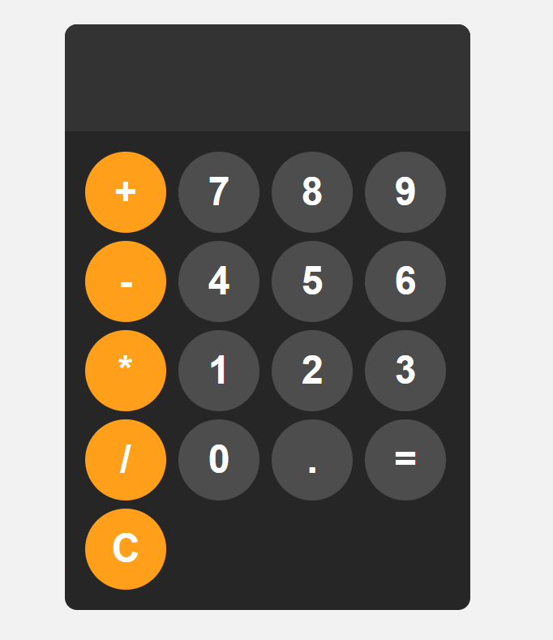

# 🧮 Calculadora Simples  

Uma calculadora básica desenvolvida em **HTML, CSS e JavaScript** para realizar operações matemáticas simples.  

## ✨ Funcionalidades  

✅ Adição ➕  
✅ Subtração ➖  
✅ Multiplicação ✖️  
✅ Divisão ➗  

## 📸 Captura de Tela  

## 🛠️ Tecnologias Utilizadas  

- **HTML** 🎨  
- **CSS** 💅  
- **JavaScript** ⚡  

